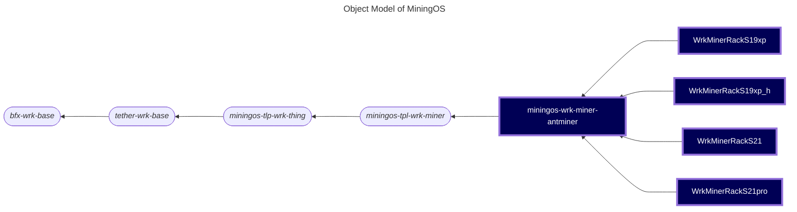

# miningos-wrk-miner-antminer

A Node.js-based worker service for managing and monitoring Bitmain Antminer cryptocurrency mining devices. This implementation provides comprehensive control over multiple Antminer models including S19 XP, S19 XP Hydro, S21, and S21 Pro, with support for monitoring, configuration, and remote management.

## Table of Contents

1. [Overview](#overview)
2. [Object Model](#object-model)
3. [Supported Models](#supported-models)
4. [Features](#features)
5. [Requirements](#requirements)
6. [Installation](#installation)
7. [Configuration](#configuration)
8. [Usage](#usage)
9. [Data Collection](#data-collection)
10. [Error Monitoring](#error-monitoring)
11. [Static IP Configuration](#static-ip-configuration)
12. [Mock Server](#mock-server)
13. [Development](#development)
14. [Notes](#notes)

## Overview

This worker extends the abstract miner worker framework to provide specific functionality for Bitmain Antminer hardware. It implements HTTP-based communication with digest authentication for secure device management and provides a standardized interface for mining operations.

## Object Model

The following is a fragment of [MiningOS object model](https://docs.mos.tether.io/) that contains the concrete classes representing **Antminer miners workers** (highlighted in blue), one generically representing any model of the brand, and four children specifically representing models **S19 XP**, **S19 XP Hydro**, **S21**, and **S21 Pro**. The rounded nodes reprsent abstract classes and the square nodes represents a concrete classes:



Check out [miningos-tpl-wrk-miner](https://github.com/tetherto/miningos-tpl-wrk-miner/) for more information about parent classes.

## Supported Models

- **[Antminer S19 XP](https://shop.bitmain.com/product/detail?pid=00020230112174741027ww6zyrL306F4)** - Air-cooled model
- **[Antminer S19 XP Hydro](https://shop.bitmain.com/product/detail?pid=00020250113141218969c3x71dcB0676)** - Liquid-cooled model with power monitoring
- **[Antminer S21](https://shop.bitmain.com/product/detail?pid=00020240402210032893O1Et7keX0682)** - Latest generation with power monitoring
- **[Antminer S21 Pro](https://shop.bitmain.com/product/detail?pid=00020240402210032893O1Et7keX0682)** - High-performance variant with power monitoring

## Features

### Core Functionality
- **Device Management**: Register, update, and remove Antminer devices
- **Real-time Monitoring**: Collect performance metrics and device status
- **Pool Management**: Configure and monitor up to 3 mining pools
- **Power Control**: Sleep and normal operating modes
- **Network Configuration**: Static and DHCP network settings
- **Temperature Monitoring**: PCB, chip, inlet, and outlet temperature tracking
- **Error Detection**: Comprehensive error monitoring with model-specific alerts
- **Power Monitoring**: Real-time power consumption (S19 XP Hydro, S21, S21 Pro)

### Supported Operations
- Reboot device
- Set LED blink status
- Configure fan control and speed
- Update admin password
- Configure frequency settings
- Monitor hashboard status
- Track share statistics

### Soon-to-be Supported Operation
- Update firmware

## Requirements
- Node.js (>= 20.0)
- Network access to Antminer devices (default port: 80)
- Secondary port access for error monitoring (default: 6060)
- Dependencies:
  - `bfx-svc-boot-js`
  - `miningos-tpl-wrk-miner`
  - `digest-fetch` (for authentication)
  - `async`
  - `fastify` (for mock server)

## Installation

1. Clone the repository
2. Install dependencies:
   ```bash
   npm install
   ```
3. Configure the worker using the example configuration files:
   ```bash
   ./setup-config.sh
   ```
## Configuration

### Common Configuration (`config/common.json`)
```json
{
  "dir_log": "logs",
  "debug": 0
}
```

### Thing Configuration (`config/base.thing.json`)
```json
{
  "collectSnapTimeoutMs": 120000,
  "collectSnapsItvMs": 60000,
  "thingRtdConcurrency": 500,
  "thresholdHashrate": 50000000,
  "miner": {
    "timeout": 60000,
    "minerDefaultPort": 80,
    "nominalEfficiencyWThs": {
      "miner-am-s19xp_h": 20.8,
      "miner-am-s19xp": 21,
      "miner-am-s21": 17.5,
      "miner-am-s21pro": 17
    },
    "pools": [
      {
        "url": "POOL_URL",
        "worker_name": "WORKER_NAME",
        "worker_password": "WORKER_PASSWORD"
      }
    ]
  }
}
```

### Model-Specific Alerts

Each model has configurable alerts with severity levels (critical, high, medium):

#### S19 XP Hydro Alerts
- **Temperature Alerts**: PCB (75°C warning, 80°C critical), Inlet (40°C warning, 45°C critical / 25°C warning, 20°C critical)
- **Hashrate Alerts**: Low/high hashrate detection
- **Hardware Alerts**: Power initialization errors, EEPROM errors, chip insufficiency
- **Pool Alerts**: Dead pools, incorrect pool configuration, worker name mismatches

## Usage

### Starting the Worker

```bash
node worker.js --wtype=wrk-miner-rack-s19xp --env=production --rack=rack01
```

Replace `s19xp` with your specific model: `s19xp_h`, `s21`, or `s21pro`.

### Registering a Miner

```javascript
{
  "method": "registerThing",
  "params": {
    "opts": {
      "address": "192.168.1.100",
      "port": 80,
      "username": "root",
      "password": "root",
      "timeout": 60000,
      "errPort": 6060
    },
    "info": {
      "serialNum": "BM123456",
      "macAddress": "00:11:22:33:44:55",
      "pos": "1_2_3",
      "container": "container-01"
    },
    "tags": ["production", "site-1"]
  }
}
```

### Available RPC Methods

Inherited from the base framework:
- `getRack`: Get rack information
- `listThings`: List all managed miners
- `registerThing`: Register a new miner
- `updateThing`: Update miner configuration
- `forgetThings`: Remove miners
- `queryThing`: Query individual miner methods
- `applyThings`: Apply operations to multiple miners
- `tailLog`: Retrieve historical data

### Miner Control Commands

Control miners through the `queryThing` RPC method:

```javascript
// Reboot a miner
{
  "method": "queryThing",
  "params": {
    "id": "miner-id",
    "method": "reboot",
    "params": []
  }
}

// Set pools
{
  "method": "queryThing",
  "params": {
    "id": "miner-id",
    "method": "setPools",
    "params": [[
      {
        "url": "stratum+tcp://pool.example.com:3333",
        "worker_name": "worker1",
        "worker_password": "x"
      }
    ]]
  }
}

// Set power mode
{
  "method": "queryThing",
  "params": {
    "id": "miner-id",
    "method": "setPowerMode",
    "params": ["normal"] // "sleep" or "normal"
  }
}

// Set LED
{
  "method": "queryThing",
  "params": {
    "id": "miner-id",
    "method": "setLED",
    "params": [true] // true to blink, false to stop
  }
}
```

## Data Collection

The worker allows configuring custom interval of time for recurrently collecting snapshots:

### Statistics
- Hashrate metrics (5s, 5m, 30m averages)
- Power consumption (W) - for supported models
- Efficiency (W/TH/s) - for S19 XP Hydro
- Temperature readings:
  - PCB inlet/outlet temperatures
  - Chip temperatures (current, as max/avg not provided by hardware)
  - Ambient temperature
- Pool share statistics (accepted, rejected, stale)
- Uptime and error status
- Hashboard performance metrics

### Configuration State
- Network settings (IP, DNS, gateway)
- Pool configurations
- Power mode (sleep/normal)
- LED status
- Fan control settings
- Firmware version

## Error Monitoring

The system monitors for various error conditions via port 6060:

### Error Codes
- R:1: Low hashrate
- N:1: High hashrate
- V:1: Power initialization error
- V:2: Power supply not calibrated
- J0:8: Insufficient hashboards
- P:1: High temperature protection
- P:2: Low temperature protection
- J[0-7]:4: EEPROM data error
- J0:6: Temperature sensor error
- M:1: Memory allocation error
- J[0-2]:2: Chip insufficiency
- L[0-2]:1: Voltage/frequency exceeds limit
- L[0-2]:2: Voltage/frequency mismatch

## Static IP Configuration

For S21 and S21 Pro models, static IPs can be automatically calculated based on container and position:

```
IP = 10.[container].[cupboard].[shelf+position]
```

Note: The shelf and position values are concatenated (not separated by a dot).

Example: Position "1_2_3" in container-05 → 10.5.1.23
- Container: 05 → 5 (leading zero removed)
- Cupboard: 1
- Shelf + Position: 2 + 3 = 23 (concatenated)
- Result: 10.5.1.23  

## Mock Server

A mock server is provided for testing without physical hardware:

```bash
node mock/server.js --type S19xp --port 8000 --host 127.0.0.1
```

The mock server provides:
- HTTP endpoints matching Antminer API structure
- Digest authentication (realm: "antMiner Configuration")
- Model-specific responses for S19xp, S19xp_h, S21, and S21pro
- Power readings endpoint (`/miner_power`) for supported models
- Error flag support via `--error` parameter

## Development

### Running Tests

```bash
npm test
```

The project includes tests for miner operations using the test framework from the parent template.

### Adding New Models

1. Create a new worker class extending the base:
   ```javascript
   class WrkMinerRackNewModel extends WrkMinerRack {
     getThingType() {
       return 'miner-am-newmodel'
     }
     
     async connectThing(thg) {
       return this._connectThing(thg, 'newmodel')
     }
   }
   ```

2. Add model-specific constants in `workers/lib/constants.js`:
   ```javascript
   DEFAULT_NOMINAL_EFFICIENCY_WTHS: {
     'miner-am-newmodel': 20  // Your model's efficiency
   }
   ```

3. If needed, create a mock router in `mock/routers/` following the pattern of existing models

4. For custom alerts, modify `workers/lib/alerts.js`

## Troubleshooting

### Common Issues

1. **Authentication Failures**
   - Default credentials: username `root`, password `root`
   - Uses HTTP Digest Authentication
   - Check network connectivity to device

2. **Temperature Data Characteristics**
   - Hardware limitation: Antminers report only current temperature
   - The API duplicates current values for avg/max readings
   - This is expected behavior, not an error

3. **Power Mode Switching**
   - Mode changes take 10-20 seconds to complete (per README.md)
   - Device may be temporarily unresponsive during transition
   - Configure appropriate timeouts in settings

4. **Serial Number Not Available**
   - Antminer API does not provide serial numbers
   - Use MAC address for unique device identification

### Debug Mode

Enable debug logging for troubleshooting:
```bash
export DEBUG=thing:proc,mock
```

Debug output will show:
- Mock server HTTP requests (when using mock)
- Worker process operations
- Error details

## Implementation Notes

### Temperature Reporting
Antminer hardware reports instantaneous temperature values only. The worker duplicates these values for avg/max fields to maintain API consistency with other miner types.

### Power Monitoring
Power consumption data is available on specific models via port 6060:
- ✅ S19XP-Hydro
- ✅ S21
- ✅ S21 Pro
- ❌ S19XP (standard)

### Pool Configuration
- Miners support multiple pools (typically 3)
- After pool configuration changes, devices automatically reboot
- Reboot process takes 2-3 minutes to complete
- Worker includes automatic reboot call after `setPools()`

### Network Configuration
The worker supports both static and DHCP network configuration. For S21/S21Pro models, static IPs can be calculated based on container position.

## Intro

Generic: https://github.com/tetherto/miningos-tpl-wrk-thing/blob/main/README.md#intro

## Setup

Generic: https://github.com/tetherto/miningos-tpl-wrk-thing/blob/main/README.md#setup

## Configuration

Generic: https://github.com/tetherto/miningos-tpl-wrk-thing/blob/main/README.md#configuration
